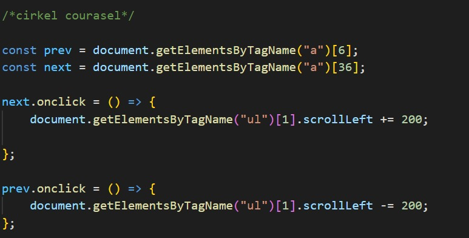

# Procesverslag
Markdown is een simpele manier om HTML te schrijven.  
Markdown cheat cheet: [Hulp bij het schrijven van Markdown](https://github.com/adam-p/markdown-here/wiki/Markdown-Cheatsheet).

Nb. De standaardstructuur en de spartaanse opmaak van de README.md zijn helemaal prima. Het gaat om de inhoud van je procesverslag. Besteedt de tijd voor pracht en praal aan je website.

Nb. Door *open* toe te voegen aan een *details* element kun je deze standaard open zetten. Fijn om dat steeds voor de relevante stuk(ken) te doen.

## Jij

  
uitwerken voor kick-off werkgroep

  ### Auteur:
  Quinesha van Burgh

  #### Je startniveau:
  rood/zwart

  #### Je focus:
  Responsive & Surface plane
 

## Je website

  
uitwerken voor kick-off werkgroep

  ### Je opdracht:
  https://www.cartoonnetwork.nl

  #### Screenshot(s) van de eerste pagina (small screen): 
  https://www.cartoonnetwork.nl
  

  #### Screenshot(s) van de tweede pagina (small screen):
  https://www.cartoonnetwork.nl/spelletjes
  
 

## Toegankelijkheidstest 1/2 (week 1)

  
uitwerken na test in 1e werkgroep

  ### Bevindingen
  Lijst met je bevindingen die in de test naar voren kwamen:

  - Het bedienen van een site is onmogelijk met de hand te doen in het geval van heftige parkinson.
  - Gedeeltelijke zicht beperkingen maaken het soms wel mogelijk om een pagina te lezen alleen gaan dan kleine details vaak verloren.

  #### Screenreader
  Hier korte omschrijving (met indien nodig afbeeldingen)

  - De screenreader verteld nog niet wat mijn afbeeldingen zijn.

  Hier een omschrijving van hoe het opgelost kan worden (met indien nodig afbeeldingen)

  - Door een alt toe te voegen aan de afbeeldingen moet dit opgelost zijn.

  #### Muis en Toetsenbord 
  Hier korte omschrijving (met indien nodig afbeeldingen)

  - Het is lastig om de site met een mijs te bedienen in het geval van een motorieke beperking.

  - het laptop toetsenbord werkt te licht met een heftige motorieke beperking waardoor meerder knoppe tegelijk 
  geselecteerd worden.

  Hier een omschrijving van hoe het opgelost kan worden (met indien nodig afbeeldingen)

  - in plaats van een muis en een licht toetsenbord, tab gebruiken op een speciaal toetsenbord ontwikkeld voor mensen met een motorieke beperking.

  #### Motoriek (shocks, elastiekjes)
  Hier korte omschrijving (met indien nodig afbeeldingen)

  - Als de fijne motoriek aangetast is door deze gesimuleerde beperkingen kan het moeilijk zijn om onderdelen 
  van de site te selecteren

  Hier een omschrijving van hoe het opgelost kan worden (met indien nodig afbeeldingen)

  - Dit kan opgelost worden door een groot toetsenbord met zware knoppen in te zetten en de site
  doormiddel van toestenbord te bedienen.

  #### Visueel (brillen, contrast, kleurenblind, dark/light). 
  Hier korte omschrijving (met indien nodig afbeeldingen)

  - Door de Grote hoeveelheid kleur en het verschil in de gekleurde onderdelen komt uit geen van de testen echt
  een probleem naar voren. Bij zowel kleurenblindheid, verminderd zicht, contrast en light/darkmode blijft 
  de site goed leesbaar.

  - Wel is de kleur van de h3 minder goed leesbaar bij blurred vision.

  Hier een omschrijving van hoe het opgelost kan worden (met indien nodig afbeeldingen)

  - Dit kan opgelost woden door de letters donkerder van kleur te maken.

## Breakdownschets (week 1)

  
uitwerken na afloop 2e werkgroep

  ### de hele pagina: 
  

  ### dynamisch deel (bijv menu): 
  

  ### wellicht nog een dynamisch deel (bijv filter): 
  

## Voortgang 1 (week 2)

  
uitwerken voor 1e voortgang

  ### Stand van zaken
  hier dit ging goed & dit was lastig (neem ook screenshots op van delen van je website en code)

  Goed:
  - Ik heb een goede start kunnen maken ondanks dat ik later ben ingesprongen vanwege een klaswissel.
  - Het maken van de eerste courasels.
  - het maken van het filter.

  Courasels:
   
   
   

  Filter:
  

  Lastig:
  - Inkomen met coderen na een lange zomer, ik was toch wel wat dingen vergeten.
  - Weten :nth-of-type etc. begrijpen, diet heb ik nog nooit eerder gebruikt.
  - coderen zonder classes, id's en div's

  ### Agenda voor meeting
  samen met je groepje opstellen

  | student 1      | student 2          | AFWEZIG      | AFWEZIG      |
  | Mike           | Quinesha           | Michelle     | Deniz        |
  | vraag 1        | vraag 1            | vraag 1      | vraag 1      |
  |                |                    |              |              |
  | Hoe maak ik    | Hoe geef ik de     |              |              |
  | hiervan een    | cirkel courasel    |              |              |
  | grid?          | een gekleurde      |              |              |
  |                | achtergrond?       |              |              |
  |                |                    |              |              |
  | vraag 2        | vraag 2            | vraag 2      | vraag 2      |
  |                |                    |              |              |
  | Hoe maak ik    | Hoe style ik       |              |              |
  | een responsive | items zonder       |              |              |
  | menu?          | id's en classes?   |              |              |
  |                |                    |              |              |
  | vraag 3        | vraag 3            | vraag 3      | vraag 3      |
  |                |                    |              |              |
  | Hoe maak ik een| Hoe kan ik mijn    |              |              |
  | automatisch    | filter het beste   |              |              |
  | image carousel | vormgeven?         |              |              |

  ### Verslag van meeting
  hier na afloop snel de uitkomsten van de meeting vastleggen

  - punt 1: Semantiek van de code moet beter, vooral li's in ul's zetten. 
  - punt 2: Absoluut geen id's en classes gebruiken tenzij het echt niet anders kan.
  - punt 3: Achtergrond kleuren van de cirkels in de carousel kunnen in een patroon gemaakt worden met behulp van  :nth-child

## Voortgang 2 (week 3)

  
uitwerken voor 2e voortgang

  ### Stand van zaken
  hier dit ging goed & dit was lastig (neem ook screenshots op van delen van je website en code)

  Goed:
  - Het maken van courasels
  - Het maken van de navbar ging goed.

  Lastig:
  - Het gebruiken van grid voor het stylen van m'n pagina.
  - Buttons op de juuste plek plaatsen.
  - Pagina responsive maken.

  Courasels:
   
   

   

  Responsiveness:
   
   
   

  ### Agenda voor meeting
  samen met je groepje opstellen

  | student 1      | student 2          | student 3    | student 4    |
  | Mike           | Quinesha           | Michelle     | Deniz        |
  | vraag 1        | vraag 1            | vraag 1      | vraag 1      |
  |                |                    |              |              |
  | Hoe maak ik    | Hoe zet ik de      | Hoe maak ik  | Hoe zet ik   |
  | een responsive | pijltjes van mijn  | een uitklap- | tekst bij    |
  | menu?          | courasel aan de    | baar menu?   | m'n footer   |
  |                | zijkanten?         |              |              |
  |                |                    |              |              |
  | vraag 2        | vraag 2            | vraag 2      | vraag 2      |
  |                |                    |              |              |
  | n.v.t.         | Hoe zet ik een     | Hoe maak je  | Hoe maak ik  |
  |                | courasel naast     | een slideshow| de Amsterdam/|
  |                | een list?          | van tekst?   | Barcelona    |
  |                |                    |              | Button       |
  |                |                    |              |              |
  | vraag 3        | vraag 3            | vraag 3      | vraag 3      |
  |                |                    |              |              |
  | n.v.t.         | waarom krijg ik een| Hoe zorg ik  | Hoe maak ik  |
  |                | witte balk wanneer | dat ik min. 2| de header en |
  |                | ik naar een klein  | max 4 items  | main bij mijn|
  |                | scherm ga?         | op een rij   | about Moco   |
  |                |                    | krijg?       | page?        |

  ### Verslag van meeting
  hier na afloop snel de uitkomsten van de meeting vastleggen

  - IK MAG 1 DIV GEBRUIKEN!!
  - op unicode.org/emoji staan emoji om te gebruiken in je code.
  - als je css een aparte lijn gebruikt voor .add en .remove classlist dan kan je beter toggle gebruiken.
  - Bekijk "just buttons" op DLO voor uitleg over courasel buttons.

## Toegankelijkheidstest 2/2 (week 4)

  
uitwerken na test in 8e werkgroep

  ### Bevindingen
  Lijst met je bevindingen die in de test naar voren kwamen (geef ook aan wat er verbeterd is):

  #### Screenreader
  Hier korte omschrijving (met indien nodig afbeeldingen)

  - De screenreader slaat sommige onderdelen van mijn site over.

  Hier een omschrijving van hoe het opgelost kan worden (met indien nodig afbeeldingen)

  - Dit komt omdat dit <a> tags zijn waren zonder href's dus door deze toe te voegen zal de screenreader deze wel zien

  #### Muis en Toetsenbord 
  Hier korte omschrijving (met indien nodig afbeeldingen)

  - Tijdens het tabben worden sommige onderdelen van mijn site overgeslagen. 

  Hier een omschrijving van hoe het opgelost kan worden (met indien nodig afbeeldingen)

  - Dit komt omdat dit <a> tags zijn waren zonder href's dus door deze toe te voegen zal de screenreader deze wel zien

  #### Motoriek (shocks, elastiekjes)
  Hier korte omschrijving (met indien nodig afbeeldingen)

  - knoppen kunnen moeilijk aan te klikken zijn in het geval van parkinson.

  Hier een omschrijving van hoe het opgelost kan worden (met indien nodig afbeeldingen)

  - Dit kan opgelost worden door deze selecteerbaar te maken doormiddel van tab en de gebruiker een groot
  verzwaard toetsenbord te laten gebruiken.

  #### Visueel (brillen, contrast, kleurenblind, dark/light). 
  Hier korte omschrijving (met indien nodig afbeeldingen)

  - Grijze letters zijn moeilijk te lezen in het geval van sommige zichtbeperkingen zoals cataract

  Hier een omschrijving van hoe het opgelost kan worden (met indien nodig afbeeldingen)

  - Dit kan opgelost woden door de letters donkerder van kleur te maken.

## Voortgang 3 (week 4)

  
uitwerken voor 3e voortgang

  ### Stand van zaken
  hier dit ging goed & dit was lastig (neem ook screenshots op van delen van je website en code)

  Goed:
  - Het maken van courasels
  - buttons maken
  - hover effecten

  Hover:
  
  

  Courasels:
  
  

  Scrollbars:
  

  Positioneren:
  
  

  Dropdown:
  
  
  

  Lastig:
  - Het gebruiken van grid voor het stylen van m'n pagina.
  - Buttons op de juuste plek plaatsen.
  - Pagina responsive maken.

  ### Agenda voor meeting
  samen met je groepje opstellen

 
  | student 1      | student 2          | student 3    | student 4    |
  | Mike           | Quinesha           | Michelle     | Deniz        |
  | vraag 1        | vraag 1            | vraag 1      | vraag 1      |
  |                |                    |              |              |
  | Hoe maak ik    | Hoe plaats ik      | Hoe zorg ik  | Hoe fix ik   |
  | een automati-  | een button op een  | ervoor dat   | mijn header? |
  | sche image     | specifieke plek?   | teksten niet |              |
  | courasel       |                    | over mijn    |              |
  |                |                    | sticky header|              |
  |                |                    | floaten      |              |
  |                |                    |              |              |
  | vraag 2        | vraag 2            | vraag 2      | vraag 2      |
  |                |                    |              |              |
  | n.v.t.         | Hoe maak/plaats    | Hoe maak je  | Hoe zet ik   |
  |                | ik een cirkel met  | een slideshow| zo een lijn  |
  |                | een icoon erin?    | van tekst?   | bij mijn     |
  |                |                    |              | footer?      |
  |                |                    |              |              |
  | vraag 3        | vraag 3            | vraag 3      | vraag 3      |
  |                |                    |              |              |
  | n.v.t.         | Hoe zorg ik dat    | Hoe zorg ik  | Hoe maak ik  |
  |                | een plaatje aan de | dat ik min 2 | een cookies  |
  |                | bovenkant van een  | max 4 items  | button?      |
  |                | button overlapt    | op een rij   |              |
  |                | maar de niet aan   | krijg?       |              |
  |                | de onderkant       |              |              |

  ### Verslag van meeting
  hier na afloop snel de uitkomsten van de meeting vastleggen

  - Geef parent een position relative en child een position absolute om de afbeeling in
  de parent te kunnen verplaatsen.
  - maak de afbeelding in de child de content van de child.
  - geed de afbeelding aan alleen de onderkant een border radius van 50% maar niet de bovenkant
  om de bovenkant te laten overlappen.
  - maak een cirkel door een <a> een achtergrondkleur en een border radius van 50% te geven.

## Eindgesprek (week 5)

  
uitwerken voor eindgesprek

  ### Je uitkomst - karakteristiek screenshots:
  

  ### Dit ging goed/Heb ik geleerd: 
  Korte omschrijving met plaatjes

  

  ### Dit was lastig/Is niet gelukt:
  Korte omschrijving met plaatjes

  

## Bronnenlijst

  
continu bijhouden terwijl je werkt

  Nb. Wees specifiek ('css-tricks' als bron is bijv. niet specifiek genoeg).

  1. afbeeldingen: https://www.cartoonnetwork.nl/
  2. pijl icon: https://www.iconsdb.com/white-icons/arrow-20-icon.html
  3. play button icon: https://www.iconsdb.com/white-icons/play-5-icon.html
  4. gradient in afbeelding: https://ishadeed.com/article/handling-text-over-image-css/
  5. cirkels met content: https://codepen.io/cheunyinz/pen/bGMvzvW
  6. Uitklapbare navbar: https://codepen.io/shooft/pen/jOxGGeN?editors=0010
  7. scrollbar verbergen: https://stackoverflow.com/questions/43186015/css-hide-scroll-bar-but-have-element-scrollable
  8. scrollbar buttons werking: https://stackoverflow.com/questions/69376386/how-i-can-create-top-button-and-left-right-scrollbar-moving-button
  9. cirkel courasel buttons schaduw: https://stackoverflow.com/questions/10463208/box-shadow-on-the-left-side-of-the-element-only
  10. arrows cirkel courasels: 
  rechts: https://www.iconsdb.com/black-icons/arrow-24-icon.html
  links: https://www.iconsdb.com/black-icons/arrow-88-icon.html
  11. checkmark icon: https://www.iconsdb.com/white-icons/checkmark-icon.html

